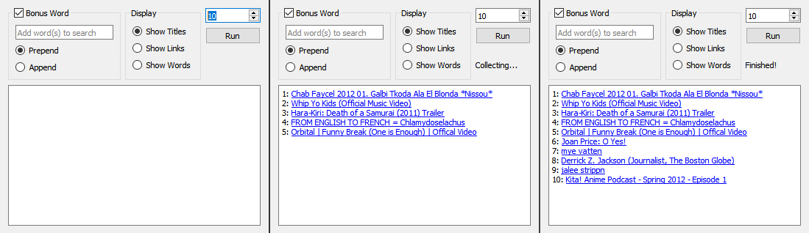
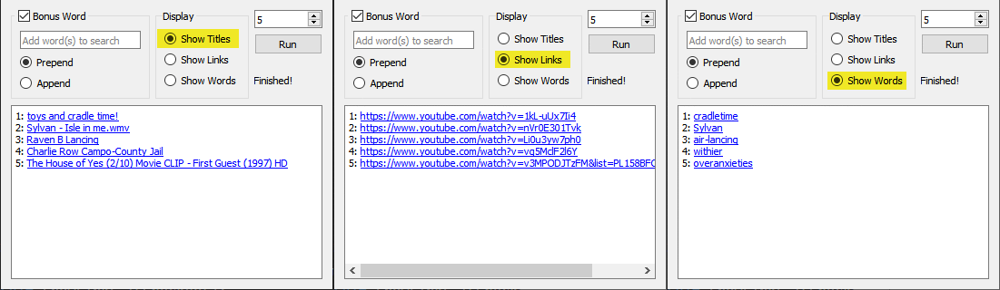

# Random YouTube Link Collector

### Collects and prints pseudo-random YouTube links.

##### *(Basic use: 10 links being collected)*

##### *(Different ways to display the links)*

## Basic Mechanism:

1. Picks a random word from a long list of words ("words.txt")

2. Searches for that word on YouTube

3. Opens a random video from the resulting page

    * It will never pick the top result to avoid picking an ad

    * If there are no results, start from step 1

4. Collects the link

5. Repeat until desired # of links are collected